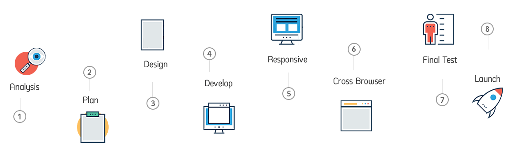
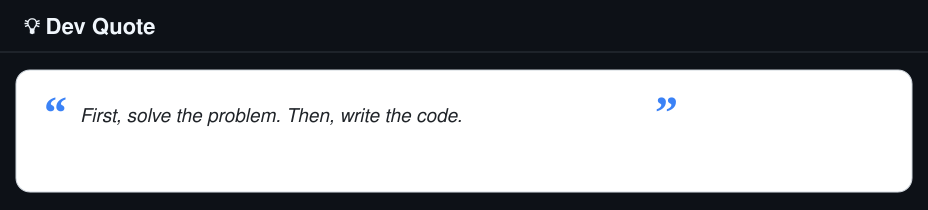

# Hi, I'm Muhammad Niaz Ali 
### Full-Stack Web Developer | JavaScript, TypeScript, React | API-First Web Apps

  

-yellow?style=for-the-badge&logo=clockify&logoColor=white&labelColor=0D1117&color=FFC107)

---

<table>
<tr>
<td align="center" width="220">
 
<b>API-first</b> 
Stable routes clear contracts.
</td>
<td align="center" width="220">
 
<b>Auth</b> 
Secure flows clean sessions.
</td>
<td align="center" width="220">
 
<b>DX</b> 
Readable code easy upgrades.
</td>
<td align="center" width="220">
 
<b>Delivery</b> 
Fast shipping fewer surprises.
</td>
</tr>
</table>

---

##  About Me
I am a full stack web developer who builds fast and reliable web applications with clean interfaces and solid backend systems. I specialize in scalable API development secure authentication flows and structured database design. I also build AI agent automation workflows using tools like n8n and LangChain to connect smart systems together and deliver real business value.

---

##  Services I Offer

<table>
<tr>
<td width="50%" valign="top">

**🌐 Web App Development**  
Full-stack apps with React, Next.js, and Node.js — fast, responsive, production ready.

**🔗 API Development & Integration**  
Secure REST APIs, third-party integrations, and clean, well-documented endpoints.

**🔐 Authentication & Database Design**  
NextAuth, Supabase, PostgreSQL, MongoDB — structured schemas and safe auth flows.

</td>
<td width="50%" valign="top">

**📊 Dashboards & Admin Panels**  
Data-driven UIs, analytics views, and internal tools tailored to your workflow.

**🤖 AI Agents & Automation**  
n8n and LangChain powered workflows that connect your tools and save manual work.

**📱 Cross-Platform Mobile Apps**  
React Native (Expo) apps for iOS and Android from a single codebase.

</td>
</tr>
</table>

---

##  What I Build
-  Dashboards admin panels and data driven UIs  
-  REST APIs auth flows and integrations  
-  Database backed systems with clear structure  
-  AI agents and automation workflows using n8n and LangChain  
-  Cross platform mobile apps with React Native  
-  Interactive 3D web experiences when needed

---

##  Currently Working On
-  Full-stack projects at **eTechViral**
-  API design auth and maintainable architecture
-  AI agent automation using n8n and LangChain
-  React Native app development
-  Performance code clarity and better DX
-  Open-source work and consistent learning

---

##  Contact
- **Email:** [mrniazali132@gmail.com](mailto:mrniazali132@gmail.com)  
- **Phone:** [+92 320 8050617](https://wa.me/923208050617)

---

##  Connect With Me

---

##  Tech Stack

 

 

---

##  GitHub Stats

---

##  Activity Graph

---

##  GitHub Analytics

---

##  GitHub Trophies

---

##  Collaboration
I am open to full stack work API development dashboards AI agent automation and database backed systems. I like clear scope clean delivery and code that stays easy to maintain.

**Best ways to reach me:**
1. **WhatsApp:** [+92 320 8050617](https://wa.me/923208050617)  
2. **Email:** [mrniazali132@gmail.com](mailto:mrniazali132@gmail.com)  
3. **LinkedIn:** [Muhammad Niaz Ali](https://www.linkedin.com/in/muhammad-niaz-ali-109167397/)

---

